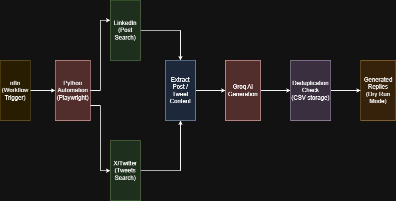

# Auto Bidding Bot (LinkedIn & X)

## Overview

Auto Bidding Bot is an automation system that detects hiring/freelancing posts on LinkedIn and X (Twitter), generates AI-powered personalized replies, and prepares automated bid responses in a safe dry-run mode.

The project uses:

* Playwright for browser automation
* Groq API for AI-generated comments
* CSV-based deduplication
* n8n for workflow orchestration
* Python as the main backend language

The current implementation focuses on:

* LinkedIn automation (fully working)
* AI-generated professional replies
* Deduplication system
* Persistent browser sessions
* n8n scheduling workflow
* Prototype support for X/Twitter automation

---

# Features

## LinkedIn Automation

* Opens LinkedIn using Playwright
* Uses persistent browser session
* Searches posts using keywords
* Detects hiring/freelancing posts
* Extracts post content dynamically
* Generates AI-based contextual replies
* Runs in safe dry-run mode (no real commenting)

---

## X (Twitter) Automation

* Opens X/Twitter using Playwright
* Searches tweets using keywords
* Extracts visible tweet content
* Generates AI-powered replies
* Prototype implementation included

---

## AI Comment Generation

The bot uses Groq LLM APIs to generate:

* Human-like replies
* Professional tone
* Personalized bidding responses
* Non-spammy contextual comments

Example generated reply:

"Hi! This opportunity looks very interesting. I have experience working with frontend technologies and web applications and would love to connect further regarding the role."

---

## Deduplication System

To avoid processing duplicate posts:

* Processed posts are stored in a CSV file
* Duplicate posts are skipped automatically
* Prevents repeated AI reply generation

File used:

```text
processed_posts.csv
```

---

## n8n Workflow Orchestration

n8n is used as the workflow scheduler/orchestrator.

Workflow:

```text
Schedule Trigger
        ↓
Execute Python Automation Script
        ↓
LinkedIn Scraping
        ↓
AI Comment Generation
        ↓
Deduplication Check
        ↓
Output Generated Replies
```

The workflow can be configured to:

* Run hourly
* Run during business hours
* Execute daily automation tasks

---

# Architecture Flow


---

# Tech Stack

| Technology  | Purpose                |
| ----------- | ---------------------- |
| Python      | Core backend scripting |
| Playwright  | Browser automation     |
| Groq API    | AI comment generation  |
| n8n         | Workflow orchestration |
| CSV Storage | Deduplication          |
| LinkedIn    | Hiring post detection  |
| X/Twitter   | Tweet detection        |

---

# Installation

## Clone Repository

```bash
git clone <repository-url>
cd Auto-Bidding-Bot
```

---

## Install Dependencies

```bash
pip install playwright groq
playwright install
```

---

## Run LinkedIn Automation

```bash
python ai_comment_generator.py
```

---

## Run Twitter/X Automation

```bash
python twitter_ai_bot.py
```

---

# Persistent Browser Session

The project uses Playwright persistent browser contexts to:

* Reuse login sessions
* Avoid repeated authentication
* Simulate real-user browser behavior

Example:

```python
context = p.chromium.launch_persistent_context(
    user_data_dir="user_data",
    headless=False
)
```

---

# Safety & Dry-Run Mode

The current implementation intentionally runs in:

# Dry-Run Mode

This means:

* No real comments are posted
* No public interaction occurs
* AI-generated replies are displayed in terminal output only

This approach was used to:

* Reduce platform ban risk
* Maintain safe testing environment
* Demonstrate automation functionality responsibly

---

# Future Improvements

Possible future enhancements:

* Real automated posting
* SQLite/Google Sheets integration
* Better tweet filtering
* Advanced NLP relevance detection
* Docker deployment
* Cloud scheduling
* Multi-account support
* Anti-detection behavior simulation

---

# Challenges Faced

* LinkedIn dynamic selectors
* Twitter anti-bot restrictions
* Dynamic content rendering
* Session persistence handling
* Filtering noisy page content

---

# Conclusion

This project demonstrates:

* Browser automation using Playwright
* AI integration using Groq APIs
* Workflow orchestration using n8n
* Deduplication systems
* Safe automation architecture
* Practical automation engineering skills

The system successfully automates the workflow of detecting hiring posts and generating contextual AI-based bid responses in a safe dry-run environment.
